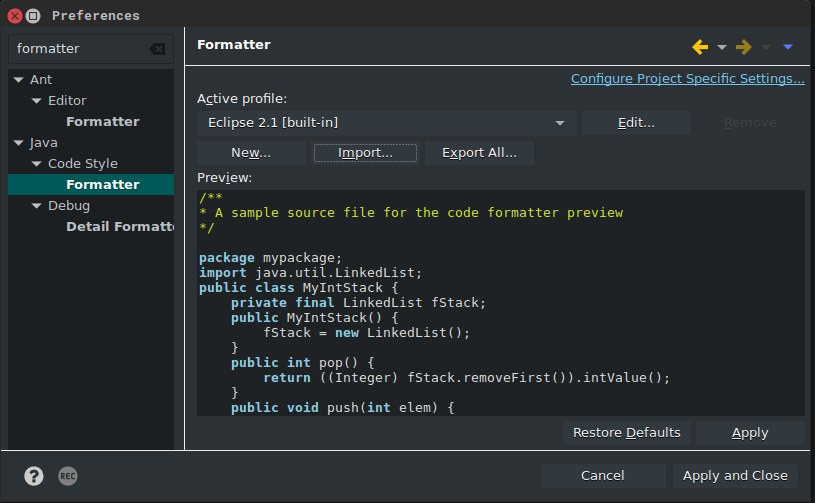

# eclipstyle
**Propagate code style & format accross multiple workspaces.**

Build (or import) a formatter profile **once:**

*You no longer have to export it as an XML file and then import it from each and every workspace:*

## How Does It Work?
 1. Fetches formatter preferences of the source workspace from `.metadata` directory.
 2. Applies those preferences to all workspaces in the given parent directory.

### Usage
``` sh
java -jar eclipstyle.jar /path/to/source/workspace /path/to/all/workspaces
```

For example:
``` sh
# windows
java -jar eclipstyle.jar D:\Dev\Workspaces\eclipstyle D:\Dev\Workspaces

# unix
java -jar eclipstyle.jar ~/eclipse_workspaces/eclipstyle ~/eclipse_workspaces
```

### Build From Source
``` sh
javac Eclipstyle.java
jar cmvf META-INF/MANIFEST.mf eclipstyle.jar Eclipstyle.class Eclipstyle$1.class Eclipstyle$Condition.class
```

### Download Binary
You can download the latest release [here](https://github.com/utkuufuk/eclipstyle/releases).

